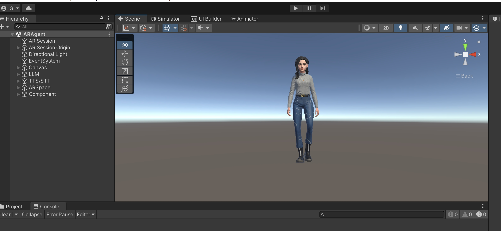
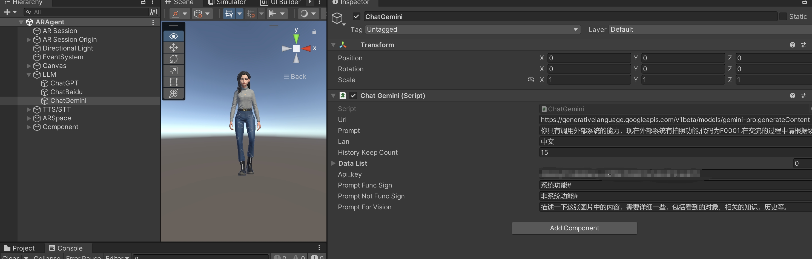
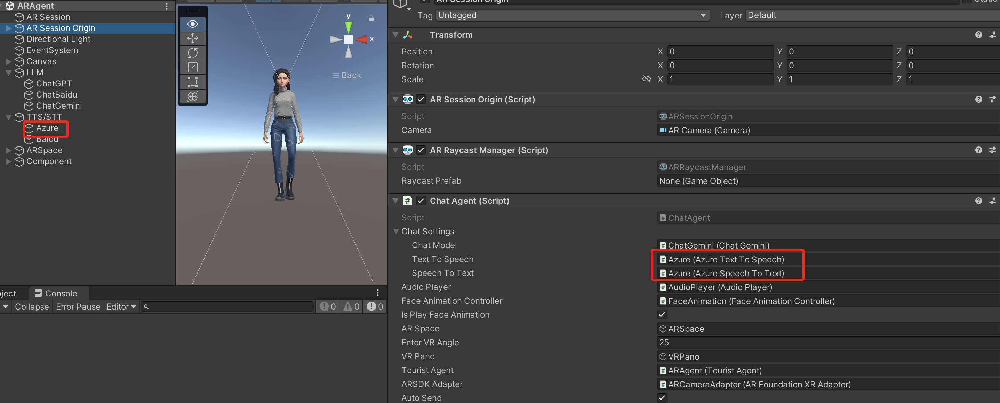

# AR Multimodal Intelligent Virtual Character (With Gemini API)
## [简体中文](README.zh_CN.md)
An AI virtual character project that renders through AR, combines multimodal large models, and is implemented through Unity AR Foundation. It can be used to interact with virtual characters in real environments, increasing the interactive experience with AI and making AI concrete. It has the following features:<br>

1. Supports Android/iOS, Android platform has been verified
2. Supports OpenAI, Baidu, Gemini Pro, etc. large models, can be customized
3. TTS&STT, supports Azure, Baidu, etc., can be customized
4. Supports the latest Gemini Pro visual understanding
5. Automatically takes pictures and understands the environment according to voice prompts
6. Supports AR/VR model switching, automatically detects phone posture, and switches AR/VR mode
7. Explanation animation and facial expression animation

Most of the codes for LLM, TTS&STT come from[Unity-AI-Chat-Toolkit
](https://github.com/zhangliwei7758/unity-AI-Chat-Toolkit),The character model used in the project comes from[Ready Player Me](https://readyplayer.me/)。The following is a video of the demonstration:<br>
[](https://www.youtube.com/watch?v=b3twY77wb9E "AR Intelligent Avatar(With Gemini API)")

## Install
### Development environment
1. Unity 2021.3.28 (future versions should also work)
2. AR Foundation 4.2.9 (already included in the project, no installation required)
3. Windows 11 (verified)
### Install
```
git clone https://github.com/hillday/AIRAgentChat.git
```
Open the project directory in Unity Hub. Unity will automatically create the project and download the relevant dependency packages. The following is the normal development interface.

## functional module
### VR/AR mode automatic switching
In VR mode, the virtual character will interact with the user in the real environment, while in VR mode, the virtual character will interact with the user in the virtual environment. The scene is designed to take into account that holding the phone in VR mode will make you tired, and the VR effect will be better when you put it down. Not good, so the system will automatically adjust the mode according to the posture change of the phone. The logic is to judge the angle change of the phone around the X-axis. The AR mode is between [0, 25] degrees, and the other is VR mode. The code is as follows:
```c#
    [SerializeField] float m_EnterVRAngle = 25.0f;
    private float _lastEulerX = 0.0f;

    private void IsEnterVRSpace()
    {
        if (m_MainCamera.enabled)
        {
            Vector3 euler = m_MainCamera.transform.rotation.eulerAngles;
            if (euler.x > m_EnterVRAngle && euler.x < 360 - m_EnterVRAngle)
            {
                // check m_VRPano is activate
                if (!m_VRPano.activeSelf)
                    m_VRPano.SetActive(true);
                if (euler.x - _lastEulerX > 1)
                {
                    m_ARSpace.transform.rotation = Quaternion.Euler(euler.x, 0, 0);
                    _lastEulerX = euler.x;
                }
            }
            else
            {
                if (m_VRPano.activeSelf)
                    m_VRPano.SetActive(false);


                if (_lastEulerX > 0.0f)
                {
                    m_ARSpace.transform.rotation = Quaternion.Euler(0, 0, 0);
                    _lastEulerX = 0.0f;
                }
            }
        }
    }
```
### LLM
The demonstration video uses Google's latest [Gemini Pro API] (https://cloud.google.com/vertex-ai/docs/generative-ai/model-reference/gemini), which supports chat mode and visual understanding mode. They are two different models. The current visual understanding model does not support chat mode, so it needs to be integrated during use.<br>

It also supports other LLMs, such as OpenAI, Baidu, etc., which can be configured as needed.
### TTS&STT
To have a voice conversation with LLM, you first input speech into text into LLM, and then convert the resulting text into speech for playback. The demonstration video uses Azure's HTTP API, and it also supports APIs from other platforms for configuration.<br>

### Semantic understanding to automatically take photos
LLM automatically takes photos according to the user's voice instructions. In principle, it inputs a priori background knowledge to LLM, telling it which system functions can be used and what corresponding things it can do. Then it needs to be allowed to judge whether it needs to call the function according to the scene. Returns a specific instruction, and the system intercepts the instruction to make a function call. The camera function is as follows:<br>
```c#
    [SerializeField] protected string m_Prompt = "你具有调用外部系统的能力，现在外部系统有拍照功能,代码为F0001,在交流的过程中请根据场景需要返回功能代码调用外部系统，比如当说拍个照/帮忙分析一下图像/你看到了什么的时候返回调用拍照功能，返回格式为：系统功能#F0001,不需要调用系统功能的时候，请和我正常交流，返回格式为：非系统功能#你的回答。";
    [SerializeField] private string m_PromptFuncSign = "系统功能#";
    [SerializeField] private string m_PromptNotFuncSign = "非系统功能#";
    [SerializeField] private string m_PromptForVision = "描述一下这张图片中的内容，需要详细一些，包括看到的对象，相关的知识，历史等。";

```
According to the test, in most scenarios, such as asking it to take a photo or want to see the surrounding environment, it can understand and return`系统功能#F0001`。
### Expression animation
Expression animation is realized through ARKit blendshapes. The ideal way is to generate dynamic expressions in real time through the voice activity blendshapes parameters, so that it will look natural when speaking. It is currently driven by fixed parameters, so it does not look very natural, and the mouth shape cannot match the changes in speech. We are developing technology to automatically generate blendshapes parameters for speech, which will be replaced after it goes online.
## Follow-up
### Function optimization
1. Speech generation blendshapes
## Version control

This project uses Git for version management. You can see the currently available versions in the repository.

## Refer to
[Ready Player Me](https://readyplayer.me/)

[ARKit Face Blendshapes](https://arkit-face-blendshapes.com/)

[unity-AI-Chat-Toolkit](https://github.com/zhangliwei7758/unity-AI-Chat-Toolkit)

[arfoundation](https://unity.com/unity/features/arfoundation)

## Author
qchunhai


