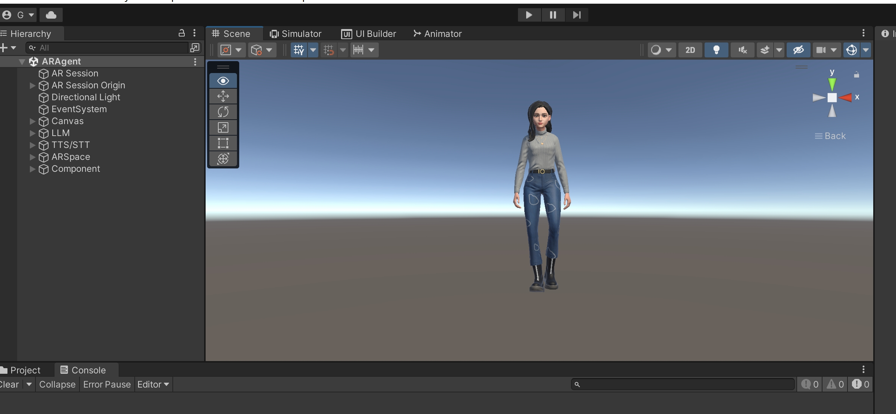

# AR多模态智能虚拟角色（With Gemini API）
一个通过AR渲染，结合多模态大模型的AI虚拟角色项目，通过Unity AR Foundation实现 。可以在真实环境中和虚拟角色对话，增加和AI的交互体验，把AI具象化。有以下特性：<br>
1. 支持Android/IOS,安卓平台经过验证
2. 支持OpenAI、Baidu、Gemini Pro等大模型，可以自定义配置
3. TTS&STT,支持Azure、Baidu等，可以自定义配置
4. 支持最新的Gemini Pro视觉理解
5. 根据语音提示，自动进行拍照和环境理解
6. 支持AR/VR模型切换，自动检测手机姿态，切换AR/VR模式
7. 讲解动画和表情动画
其中关于LLM、TTS&STT的代码大部分来源于[Unity-AI-Chat-Toolkit
](https://github.com/zhangliwei7758/unity-AI-Chat-Toolkit),项目使用的角色模型来源于[Ready Player Me](https://readyplayer.me/)。以下为演示的视频:<br>
[](https://www.youtube.com/watch?v=b3twY77wb9E "AR Intelligent Avatar(With Gemini API)")
## 安装
### 开发环境
1. Unity 2021.3.28(往后的版本应该也行)
2. AR Foundation 4.2.9(项目中已经包含，无需安装)
3. Windows 11（验证过）
### 安装
```
git clone https://github.com/hillday/AIRAgentChat.git
```
在Unity Hub中打开所在项目目录，Unity会自动创建项目和下载相关依赖包，以下是正常的开发界面。

## 功能模块
### VR/AR模式自动切换
VR模式下虚拟角色会在真实的环境中与用户进行交互，VR模式下则在虚拟的环境中和用户交互，这样设计的场景是考虑到VR模式下一直举着手机会累，放下的时候VR效果不好，所以系统会根据手机的位姿变化自动调整模式，逻辑是通过判断手机绕X轴的角度变化判断，在[0,25]度之间为AR模式，其他为VR模式，代码如下：
```c#
    [SerializeField] float m_EnterVRAngle = 25.0f;
    private float _lastEulerX = 0.0f;

    private void IsEnterVRSpace()
    {
        if (m_MainCamera.enabled)
        {
            Vector3 euler = m_MainCamera.transform.rotation.eulerAngles;
            if (euler.x > m_EnterVRAngle && euler.x < 360 - m_EnterVRAngle)
            {
                // check m_VRPano is activate
                if (!m_VRPano.activeSelf)
                    m_VRPano.SetActive(true);
                if (euler.x - _lastEulerX > 1)
                {
                    m_ARSpace.transform.rotation = Quaternion.Euler(euler.x, 0, 0);
                    _lastEulerX = euler.x;
                }
            }
            else
            {
                if (m_VRPano.activeSelf)
                    m_VRPano.SetActive(false);


                if (_lastEulerX > 0.0f)
                {
                    m_ARSpace.transform.rotation = Quaternion.Euler(0, 0, 0);
                    _lastEulerX = 0.0f;
                }
            }
        }
    }
```
### LLM
演示视频中使用的是Google最新的[Gemini Pro API](https://cloud.google.com/vertex-ai/docs/generative-ai/model-reference/gemini),支持聊天模式和视觉理解模式，是两个不同的模型，当前视觉理解模型不支持聊天模式，因此在使用过程中需要进行整合。<br>

也支持其他LLM,比如OpenAI、Baidu等的，根据需要配置即可。
### TTS&STT
和LLM语音对话的是通过先把语音转文字输入到LLM,得到的文字再转成语音进行播放的方式，演示视频使用的是Azure的HTTP API，也支持其他平台的API进行配置即可。<br>

### 语义理解自动拍照
LLM根据用户的语音指令进行自动拍照，原理的给LLM输入先验的背景知识，告诉它可以用哪些系统功能和其对应能做些什么事情，然后需要让它根据场景判断是否需要调用功能，需要的返回特定指令，系统拦截指令进行功能调用。拍照功能现实如下:<br>
```c#
    [SerializeField] protected string m_Prompt = "你具有调用外部系统的能力，现在外部系统有拍照功能,代码为F0001,在交流的过程中请根据场景需要返回功能代码调用外部系统，比如当说拍个照/帮忙分析一下图像/你看到了什么的时候返回调用拍照功能，返回格式为：系统功能#F0001,不需要调用系统功能的时候，请和我正常交流，返回格式为：非系统功能#你的回答。";
    [SerializeField] private string m_PromptFuncSign = "系统功能#";
    [SerializeField] private string m_PromptNotFuncSign = "非系统功能#";
    [SerializeField] private string m_PromptForVision = "描述一下这张图片中的内容，需要详细一些，包括看到的对象，相关的知识，历史等。";

```
根据测试，大部分场景，比如让它拍个照，想看看周围环境，它是可以理解并能返回`系统功能#F0001`。
### 表情动画
表情动画是通过ARKit blendshapes实现，理想的方式是实时通过语音驱动blendshapes参数进行动态表情生成，讲话的时候看起来就会自然。目前是通过固定的参数驱动，所以看起来不是很自然，口型对不上语音的变化，我们正在研发语音自动生成blendshapes参数的技术，上线后会替换。
## 后续工作
### 功能优化
1. 语音生成blendshapes
## 版本控制

该项目使用Git进行版本管理。您可以在repository参看当前可用版本。

## 参考
[Ready Player Me](https://readyplayer.me/)

[ARKit Face Blendshapes](https://arkit-face-blendshapes.com/)

[unity-AI-Chat-Toolkit](https://github.com/zhangliwei7758/unity-AI-Chat-Toolkit)

[arfoundation](https://unity.com/unity/features/arfoundation)

## 作者

qchunhai


